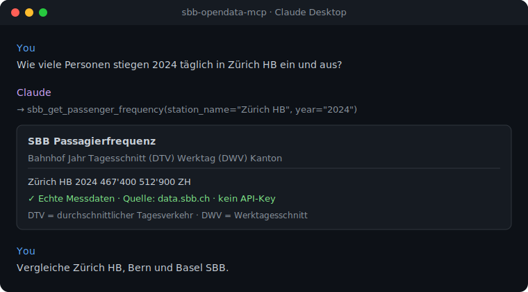

# 🚆 sbb-opendata-mcp

🇨🇭 **Part of the [Swiss Public Data MCP Portfolio](https://github.com/malkreide/swiss-public-data-mcp)**

[](https://pypi.org/project/sbb-opendata-mcp/)
[](https://opensource.org/licenses/MIT)
[](https://www.python.org/downloads/)
[](https://modelcontextprotocol.io/)
[](https://data.sbb.ch/)


> MCP server connecting AI models to Swiss Federal Railways (SBB) open data – passenger frequency, live rail disruptions, infrastructure & real-estate projects, train counts, platform data, rolling stock and station search from [data.sbb.ch](https://data.sbb.ch/). **No API key required.**

[🇩🇪 Deutsche Version](README.de.md)

### Demo



---

## Overview

**sbb-opendata-mcp** gives AI assistants like Claude direct access to public SBB
data – no copy-pasting or manual API calls. A question like *"How many passengers
passed through Zürich HB every day in 2024?"* is answered with real measured data.

The SBB Open Data portal speaks the OpenDataSoft REST API (v2.1). This server
translates it into clean Markdown and JSON for the AI model, and adds MCP
`structuredContent` alongside the human-readable text so programmatic clients can
consume the underlying records without re-parsing. The server is model-agnostic
and works with any MCP-compatible client.

**Anchor demo query:** *"Compare Zürich HB, Bern and Basel SBB by passenger frequency and platform capacity."*
→ [More use cases by audience](EXAMPLES.md) →

---

## Features

- 📊 **Passenger frequency** – boardings/alightings by station and year (daily averages)
- 🚨 **Live rail disruptions** – traffic messages, updated every 5 minutes
- 🏗️ **Infrastructure projects** – station and line construction
- 🏢 **Real-estate projects** – SBB property development (daily updates)
- 🚆 **Trains per segment** – train counts per route (SBB, BLS, SOB …)
- 🛤️ **Platform data** – length, type, area, step-free access
- 🚃 **Rolling stock** – capacity and year built
- 🔁 **Station comparison** – up to 10 stations across multiple datasets
- 🔍 **Stop search** – Swiss DiDok register (all of Switzerland)
- 📦 **Dataset catalogue** – list all ~89 SBB open datasets
- 🔑 **No API key** – all data is public and free to use
- ☁️ **Dual transport** – stdio for Claude Desktop, Streamable HTTP for cloud deployment

---

## Prerequisites

- Python 3.11+
- No API key — all data comes from the public [data.sbb.ch](https://data.sbb.ch) portal

Install [uv](https://github.com/astral-sh/uv) (recommended):

```bash
curl -LsSf https://astral.sh/uv/install.sh | sh
```

---

## Installation

From [PyPI](https://pypi.org/project/sbb-opendata-mcp/):

```bash
pip install sbb-opendata-mcp
```

Or with `uvx` (no permanent installation):

```bash
uvx sbb-opendata-mcp
```

For local development, install from a clone in editable mode:

```bash
git clone https://github.com/malkreide/sbb-opendata-mcp.git
cd sbb-opendata-mcp
pip install -e ".[dev]"
```

---

## Quickstart

```bash
# Start the server (stdio mode for Claude Desktop)
sbb-opendata-mcp
```

Try it immediately in Claude Desktop:

> *"How many people boarded at Zürich HB daily in 2024?"*
> *"Are there any current disruptions on the Swiss rail network?"*

---

## Configuration

### Environment Variables

The server needs no configuration to run over stdio. The variables below tune the
optional Streamable HTTP transport, logging and observability.

| Variable | Effect | Default |
|---|---|---|
| `MCP_HOST` | Bind host for the HTTP transport. Keep `127.0.0.1` locally; only bind `0.0.0.0` inside a controlled container/cloud environment. | `127.0.0.1` |
| `MCP_PORT` | Port for the HTTP transport. | `8000` |
| `MCP_ALLOWED_HOSTS` | Comma-separated host allow-list for DNS-rebinding protection (e.g. `your-app.onrender.com,your-app.onrender.com:*`). | localhost only |
| `MCP_ALLOWED_ORIGINS` | Comma-separated browser-origin allow-list (e.g. `https://your-app.onrender.com`). | _(none)_ |
| `LOG_LEVEL` | Log verbosity (`DEBUG`/`INFO`/`WARNING`/…). | `INFO` |
| `LOG_FORMAT` | `json` for structured logs; anything else for human-readable text. Always written to stderr. | `text` |

> 🔒 DNS-rebinding / Origin protection is **always on**; localhost is allow-listed
> so local HTTP development works out of the box. Logs go to **stderr** — stdout is
> reserved for the stdio JSON-RPC channel.

### Claude Desktop Configuration

```json
{
  "mcpServers": {
    "sbb-opendata": {
      "command": "uvx",
      "args": ["sbb-opendata-mcp"]
    }
  }
}
```

**Config file locations:**
- macOS: `~/Library/Application Support/Claude/claude_desktop_config.json`
- Windows: `%APPDATA%\Claude\claude_desktop_config.json`

Restart Claude Desktop — the server is downloaded automatically on first use.

### Other MCP Clients

Works with Cursor, Windsurf, VS Code + Continue, LibreChat, Cline and self-hosted
models via `mcp-proxy` — same configuration as above.

### Cloud Deployment (Streamable HTTP)

For use via **claude.ai in the browser** or remote servers (e.g. [Render.com](https://render.com)). The cloud transport is **Streamable HTTP** (endpoint `/mcp`).

**Docker (recommended):**

```bash
# Build + run with explicit resource limits (see docker-compose.yml)
docker compose up --build
# → http://127.0.0.1:8000/mcp
```

The image is a multi-stage build running as a **non-root** user; `docker-compose.yml`
adds `read_only`, `no-new-privileges` and memory/CPU/PID limits.

**Manual / Render.com:**

```bash
pip install -e .

# Bind publicly (behind a rate-limiting reverse proxy) and configure
# DNS-rebinding / Origin protection for your hostname:
export MCP_HOST=0.0.0.0
export MCP_ALLOWED_HOSTS="your-app.onrender.com,your-app.onrender.com:*"
export MCP_ALLOWED_ORIGINS="https://your-app.onrender.com"
python -m sbb_opendata_mcp.server --http --port 8000
```

> ⚠️ **Binding:** In a network transport the server binds to `127.0.0.1` by
> default so a locally started server is **not** exposed to your whole network.
> Set `MCP_HOST=0.0.0.0` **only** in a container/cloud environment where binding
> to all interfaces is intended (the Docker image does this for you), and place
> the server behind a reverse proxy that enforces rate limiting (and
> authentication, if the endpoint should not be public). See [`SECURITY.md`](SECURITY.md).

---

## Available Tools

| Tool | Description | Data Update |
|------|-------------|-------------|
| `sbb_get_passenger_frequency` | Boardings/alightings by station and year (daily avg.) | Annual |
| `sbb_get_rail_disruptions` | Live rail traffic messages | Every 5 min. |
| `sbb_get_infrastructure_construction_projects` | Infrastructure construction (stations, lines) | Ongoing |
| `sbb_get_real_estate_projects` | SBB real estate development projects | Daily |
| `sbb_get_trains_per_segment` | Train counts per route segment (SBB, BLS, SOB …) | Annual |
| `sbb_get_platform_data` | Platform data (length, type, area) | Ongoing |
| `sbb_get_rolling_stock` | Rolling stock (capacity, year built) | Ongoing |
| `sbb_compare_stations` | Compare up to 10 stations (multi-dataset) | – |
| `sbb_search_stations` | Search stops (Swiss DiDok register, all CH) | Ongoing |
| `sbb_list_datasets` | List all ~89 SBB open datasets | – |

All tools support `response_format: "markdown"` (human-readable) and `"json"`
(machine-readable), plus pagination. Every tool also returns MCP `structuredContent`
(the underlying records/metadata) alongside the rendered text.

### Example Use Cases

| Query | Tool |
|---|---|
| *"How many people boarded at Zürich HB daily in 2024?"* | `sbb_get_passenger_frequency` |
| *"Are there any current disruptions on the Swiss rail network?"* | `sbb_get_rail_disruptions` |
| *"Compare Zürich HB, Bern and Basel SBB"* | `sbb_compare_stations` |
| *"Which SBB construction projects are active in Zürich?"* | `sbb_get_infrastructure_construction_projects` |
| *"How many trains run yearly on the Zürich–Winterthur route?"* | `sbb_get_trains_per_segment` |
| *"Which stops exist in Wädenswil?"* | `sbb_search_stations` |

→ [More use cases by audience](EXAMPLES.md)

---

## Architecture

```
┌─────────────────┐     ┌───────────────────────────┐     ┌──────────────────────────┐
│   Claude / AI   │────▶│   SBB Open Data MCP       │────▶│       data.sbb.ch        │
│   (MCP Host)    │◀────│   (MCP Server)            │◀────│                          │
└─────────────────┘     │                           │     │  OpenDataSoft REST v2.1  │
                        │  10 Tools                 │     │  (public, no API key)    │
                        │  Stdio | Streamable HTTP  │     │                          │
                        │                           │     │  passagierfrequenz       │
                        │  Shared httpx client      │     │  rail-traffic-information │
                        │  (pooled, lifespan-managed)│    │  construction-projects   │
                        │  ODSQL escaping + Pydantic │     │  perron · rollmaterial   │
                        │  validation               │     │  zugzahlen · dienststellen│
                        └───────────────────────────┘     └──────────────────────────┘
```

---

## Project Structure

```
sbb-opendata-mcp/
├── src/sbb_opendata_mcp/
│   ├── __init__.py
│   └── server.py                   # FastMCP server, all 10 tool definitions
├── tests/
│   └── test_server.py              # Unit + live API smoke tests
├── audits/                         # MCP best-practice audit evidence
├── docs/assets/demo.svg            # README demo asset
├── .github/workflows/ci.yml        # GitHub Actions (Python 3.11/3.12/3.13)
├── Dockerfile                      # Multi-stage, non-root runtime image
├── docker-compose.yml              # Local run with resource limits
├── claude_desktop_config.json      # Example Claude Desktop config
├── pyproject.toml
├── CHANGELOG.md
├── CONTRIBUTING.md
├── SECURITY.md
├── EXAMPLES.md
├── LICENSE
├── README.md                       # This file (English)
└── README.de.md                    # German version
```

---

## Safety & Limits

- **Read-only:** All 10 tools perform read-only HTTP GET requests — no data is written, modified, or deleted upstream.
- **No personal data:** Queries are transient and not stored. The portal returns aggregated statistics, infrastructure and operational metadata. No PII is processed or retained.
- **No API key:** Data is public and free. There is no authentication and no secret to manage.
- **Injection-hardened:** `year`/`canton` are regex-validated and every value interpolated into an ODSQL `where` clause is escaped via a central helper.
- **Data freshness:** Real-time tools (disruptions) reflect the upstream source at query time; statistical datasets update annually/daily (see the tool table).
- **Terms of service:** Data is published under the [data.sbb.ch licence](https://data.sbb.ch/page/licence) (NonCommercialAllowed-CommercialAllowed-ReferenceRequired).
- **No guarantees:** This server is a community project, not affiliated with SBB. Availability depends on the upstream API.

See [`SECURITY.md`](SECURITY.md) for the full security posture.

---

## Known Limitations

- **Passenger frequency:** Updated annually; the latest full year may lag by some months.
- **Rail disruptions:** Returns all current Swiss rail messages → use `limit` and pagination.
- **Trains per segment:** Counts are yearly aggregates, not real-time.
- **Station search:** Covers the full Swiss DiDok register (all operators), not just SBB.
- **No rate limiting of its own:** Place a public HTTP deployment behind a rate-limiting reverse proxy.

---

## Testing

No API key is required.

```bash
# Unit tests (no network required)
PYTHONPATH=src pytest tests/ -m "not live"

# Live API smoke tests (require network access to data.sbb.ch)
PYTHONPATH=src pytest tests/ -m live
```

---

## Changelog

See [CHANGELOG.md](CHANGELOG.md)

---

## Contributing

See [CONTRIBUTING.md](CONTRIBUTING.md)

---

## License

MIT License — see [LICENSE](LICENSE)

---

## Author

Hayal Oezkan · [github.com/malkreide](https://github.com/malkreide)

---

## Credits & Related Projects

- **Data:** [data.sbb.ch](https://data.sbb.ch/) – Swiss Federal Railways (SBB) Open Data, OpenDataSoft REST API v2.1
- **Protocol:** [Model Context Protocol](https://modelcontextprotocol.io/) – Anthropic / Linux Foundation
- **Related:**
  - [swiss-transport-mcp](https://github.com/malkreide/swiss-transport-mcp) – real-time timetables, journeys & disruptions (opentransportdata.swiss)
  - [swiss-road-mobility-mcp](https://github.com/malkreide/swiss-road-mobility-mcp) – micromobility & EV charging
  - [zurich-opendata-mcp](https://github.com/malkreide/zurich-opendata-mcp) – MCP server for Zurich city open data
- **Portfolio:** [Swiss Public Data MCP Portfolio](https://github.com/malkreide/swiss-public-data-mcp)
